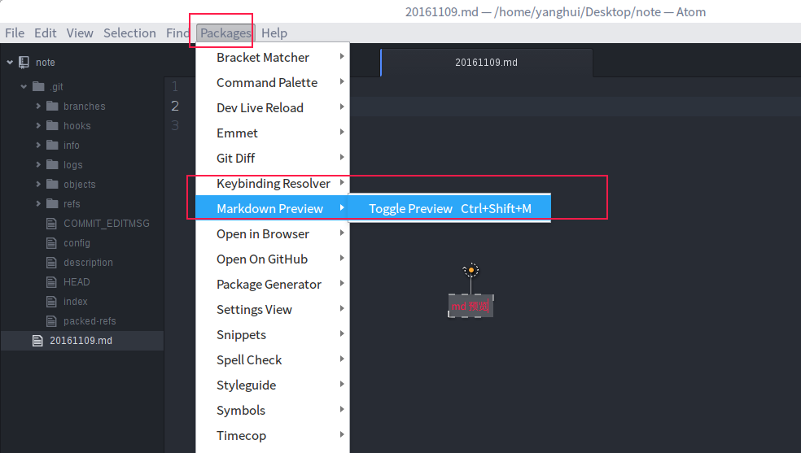

# 这是一级标题
## 这是二级标题
### 这是三级标题
#### 我是四级标题
##### #号后面有空格，我是五级标题
###### 我是六级标签

### 我是p标签

我是一个p

我是一个p

我是一个p

用enter

### 我是a标签

[百度](http://www.baidu.com)

### 加粗 倾斜

**加粗**  

*倾斜*

### 我是一张图片




### 我是 pre 标签

```js
 console.log('aaa')
   console.log('aaa')
    console.log('aaa')
       console.log('aaa')

```
### 我是 code 标签

我们正在学习 `javascript` 非常有意思。


### 我是无序列表

- 我是li
  - 234453535
    - 12232323、
    - 阿斯达大大
    - 所得税的发生
  - 234453535  
  - 234453535  
  - 234453535

- 我是li
- 我是li
- 我是li
- 我是li
- 我是li

### 我是有序列表

1. 我是有序列表的li
2. 我是有序列表的li
3. 我是有序列表的li
4. 我是有序列表的li
5. 我是有序列表的li
6. 我是有序列表的li

### 我是hr标签

***

---
