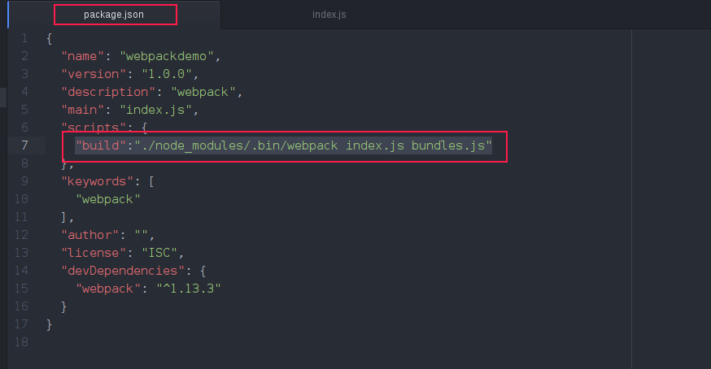

# 2016年11月15日

### 面向对象的 keyword

keyword 关键字，是程序自己保留的字符串（我们不能占用来做变量名），程序用关键字发挥固定的语法作用。

- class ：意思是类，作用是声明一个类
- this ：意思是当前，作用是指代 **当前对象**
- new ： 新建，作用新建实例，或者说创建一个对象（object）
- constructor() ：构造函数，在新建对象的时候，自动被执行，作用是对对象进行一些初始化操作
- extends ：本意是扩展，作用就是实现类的继承（inherit）
- super() ：本意是 **超** ，作用就是执行 **父类的构造函数** ，实际中子类的constructor 之中，直接使用this 会报错，，加super()就解决

通过对关键字的总结，我们回顾了 oop 的基本概念，虽然还有一些概念没有讲到，但是有了上面这些，就可以去读一些实际项目了。

### 模块入门

模块（module），基本意思就是把一个大程序，切分成多个文件。这样说白了，一个文件就是一个模块。但是，在js编程领域，模块有自己的一些固定的使用语法。

根据模块中导入/到处语法不同，模块可以分为多种，但是我们课程中要求大家掌握的就是要求大家掌握的就是两种
- ES6模块，在ES6 环境下使用，前台写React的时候，都用ES6模块。
- Commonjs 模块，在Nodejs环境下使用，后台写服务器端的代码，暂时都用commonjs 模块，未来随着nodejs对ES6支持越来越好，后台我们也可能会直接使用 ES6 模块


### ES6 模块

nodejs modules ，或者叫 commonjs 模块，基本语法如下：

```
require('./path')
module.exports={}
```

这种方式，我们暂时放一放。先来瞄准，react 写前台的时候要用的 ES6 模块。


es6 module 基本语法如下：

```
export // (命名导出,默认导出)
import // 导入
```

### es6模块到底为了帮我们解决什么问题

es6模块的引入，基于的现实是当前web项目变得复杂了，所以js文件会切分成不同的多个文件，这样，没有模块之前我们是使用 `<script>` 标签来导入多个文件，但是，一个html文件中有几十个script标签来加载 js文件，那么造成的问题就是：
- 会发出多个http请求，影响页面假造速度
- 各个js文件之间的依赖关系混乱，给项目管理带来了困难

于是es6模块就是我们的救星。

### 模块默认隔离所有内容

```
class Person{
  sayHello(){
    console.log('hello');
  }
}

let yanghui = new Person;
yanghui.sayHello();
```


是这样，一个文件中我们定义一个变量（或者一个类，函数），那么它的作用范围一般就是在整个文件内可以用了，这样的好处是使用方便，但是，当程序写大之后，变量名冲突就会带来调试困难。针对这个问题，ES6 模块的默认行为是**隔离**，一个变量一旦移动到模块中，那么即使我们导入模块文件，那么默认情况下，这个变量也不能在模块之外的位置被访问到。


既然模块中的变量，默认是隔离的，那么就需要我们明文的去进行变量的导入和导出。有两种形式：
- 如果只需要导出一个变量，那就用 `export default Person` ；配合 `import Person from './Person.js'` ，这种叫做 **默认导出**
- 如果有多个变量要导出，那就 `export { Person，i};`，配合 `import { Person, i} from ./Person` ，这种形式叫做**命名导出**

### 安装第三方模块

实际项目中，我们还需要安装大量的第三方模块，一般都是从 npmjs.com 上下载。


安装，就是要在一个 nodejs 项目中（首先保证项目中有 package.json） 文件

```
npm install --save react
```

使用，要导入一个第三方的模块，就不需要写路径

```
import React from 'react';
```

好，模块的知识我们就介绍这些就够用了。

### 进入 React 部分

参考： http://haoqicat.com/react-baby


# 安装webpack
```
//执行命令
npm init
//生成package.json
```
```
npm install --save-dev webpack
```

新建index.html

执行命令

```
"build":"./node_modules/.bin/webpack index.js bundles.js"
```

package.json文件代码如下：
```
{
  "name": "webpackdemo",
  "version": "1.0.0",
  "description": "webpack",
  "main": "index.js",
  "scripts": {
    "build":"./node_modules/.bin/webpack"
  },
  "keywords": [
    "webpack"
  ],
  "author": "",
  "license": "ISC",
  "devDependencies": {
    "webpack": "^1.13.3"
  }
}

```



生成bundles.js

新建`webpack.config.js`,粘贴下列代码
```
module.exports={
  entry:'./index.js',
  output:{
    filename:'bundle.js'
  }
}

```
执行 npm run build

新建 build 和 src 两个文件加，将index.js和bundle.js删掉，修改一下webpack.json。新建一个index.js保存src文件夹下

```
module.exports={
  entry:'./src/index.js',
  output:{
    filename:'./build/bundle.js'
  }
}

```

执行命令

```
npm run build
```

在build文件夹下自动生成一个`bundle.js`


webpage.json代码修改一下

```
"scripts": {
    "build":"./node_modules/.bin/webpack -p"
  },
  //-p是--production的缩写
```
- webpack 开发环境下编译
- webpack -p 产品编译及压缩
- webpack --watch 开发环境下持续的监听文件变动来进行编译(非常快!)
- webpack -d 引入 source maps
- webpack --progress 显示构建进度
- webpack --display-error-details 这个很有用，显示打包过程中的出错信息
- webpack --profile 输出性能数据，可以看到每一步的耗时

删掉biuld文件夹，执行一下`rm -r build` 再执行 `npm run build` ，自生成了一个 biuld文件夹,webpage.json是一个压缩的文件


另外，让我们使用webpack-dev-server来起一个本地服务进行调试,这里任然用的是项目内部的webpack-dev-server

```
npm install --save-dev webpack-dev-server

```
webage.json
```
"scripts": {
    "build": "./node_modules/.bin/webpack -w -d",
    "dev":"./node_modules/.bin/webpack-dev-server"
  },
  //./node_modules/.bin/webpack-dev-server
```
删除buile文件夹
执行命令 npm run dev
在浏览器输入 http://localhost:8080/即可访问
build不用建立也可以使用，webpack-dev-server


- webpack-dev-server - 在 localhost:8080 建立一个 Web 服务器
- webpack-dev-server --devtool eval - 为你的代码创建源地址。当有任何报错的时候可以让你更加精确地定位到文件和行号
- webpack-dev-server --progress - 显示合并代码进度
- webpack-dev-server --colors - 命令行中显示颜色
- webpack-dev-server --content-base build - - webpack-dev-server服务会默认以当前目录伺服文件，如果设置了content-base的话，服务的根路径则为build目录
- webpack-dev-server --inline 可以自动加上dev-server的管理代码，实现热更新
- webpack-dev-server --hot 开启代码热替换，可以加上HotModuleReplacementPlugin
- webpack-dev-server --port 3000 设置服务端口  可以更改临时端口号 3000 4000 
